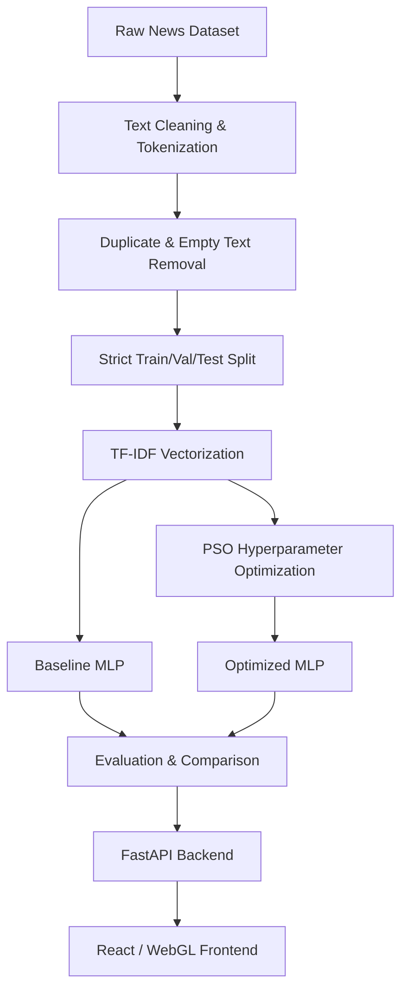

# Fake News Detection using PSO-Optimized Neural Network

Welcome to the Fake News Detection (FND) project. This repository contains a complete academic research project evaluating the effectiveness of Particle Swarm Optimization (PSO) for hyperparameter tuning in a Multi-Layer Perceptron (MLP) built to classify fake and real news.

This project delivers a full end-to-end pipeline: from dataset preprocessing and leakage-safe TF-IDF vectorization, to baseline neural network training, PSO optimization, and a responsive 3D WebGL web application that serves real-time inference.

---

## 🧪 Quick Test Articles

Since the model is trained on a specific Kaggle dataset consisting primarily of **US political news from 2016-2017**, it performs best on in-distribution text. Try copy-pasting the following excerpts into the Web UI or CLI demo to see it in action:

**✅ REAL NEWS (US Politics)**
> WASHINGTON (Reuters) - The U.S. Senate on Thursday overwhelmingly passed a sweeping $700 billion defense policy bill that backs President Donald Trump’s call for a bigger, stronger military but sets the stage for a battle over government spending later this year.

**❌ FAKE NEWS (US Politics)**
> Donald Trump just gave a bizarre speech to the Boy Scouts of America, and it was a complete disaster. He ranted about fake news, attacked Obama, and completely ignored the values of the organization. Parents are furious and demanding an apology from the White House.

---

## Project Overview

The project flows from raw news text to a deployed web interface, ensuring academic rigor and strict train/test isolation at every phase.



The system separates the **Research Pipeline** (cleaning, optimizing, and training models locally) from the **Application Layer** (FastAPI and React), allowing users to seamlessly interact with the resulting trained models.

---

## Research Problem & Objectives

**Problem:** Can Particle Swarm Optimization (PSO) effectively explore the hyperparameter space of a neural network to produce a structurally smaller or more accurate classifier for Fake News Detection?

**Objective:** The primary objective of this project is to compare a manually configured neural network (Baseline MLP) against a PSO-optimized neural network (Optimized MLP) to classify text as either FAKE or REAL.

---

## Dataset

This project utilizes the highly cited **Fake and real news dataset** by Clément Bisaillon.

- **Dataset Name:** Fake and real news dataset
- **Official Source:** Kaggle
- **Official URL:** [Kaggle - Fake and real news dataset](https://www.kaggle.com/datasets/clmentbisaillon/fake-and-real-news-dataset)
- **Files Used:** `Fake.csv`, `True.csv`
- **Language:** English
- **Labels:** `0` = FAKE, `1` = REAL
- **Original Records:** 44,898 (23,481 Fake, 21,417 Real)
- **Final Cleaned Records:** 38,582 (17,393 Fake, 21,189 Real)

**Preprocessing Steps:** Lowercasing, punctuation removal, non-alphabetic filtering, NLTK stopword removal, and tokenization. 5,600 exact duplicates and all empty texts were systematically removed.
**Data Split:** Train (70%, 27,007), Validation (15%, 5,787), Test (15%, 5,788)

### Datasets Considered but Not Used
- **Sri Lankan Fake News Datasets:** Initially investigated to provide localized research value. However, they were ultimately excluded due to language mismatch (Sinhala/Tamil vs English requirements), the lack of high-volume structured tabular downloads, and incompatibility with standard English NLP pipelines. No Sri Lankan data was used for training or testing.

> **Note on Dataset Deployment:** The raw Kaggle datasets (`Fake.csv` and `True.csv`) and large processed `.npz` arrays are **intentionally excluded from GitHub** due to size limitations, licensing terms, and repository hygiene. You do not need them to run the web application or CLI inference, as the pre-trained weights and TF-IDF mappings are checked in.

---

## System Architecture

The FND application utilizes a modern, decoupled architecture:

1. **Browser**: Client interface.
2. **React / Vite / WebGL**: The presentation layer (Frontend).
3. **Nginx Reverse Proxy**: Securely routes `/api/` traffic directly to the backend.
4. **FastAPI**: The asynchronous inference server (Backend).
5. **Inference Pipeline**: Text sanitization and preprocessing.
6. **TF-IDF**: Vocabulary matching (5,000 features).
7. **PyTorch MLP**: The selected model (Baseline or PSO) executing the forward pass.
8. **Prediction**: Returns a JSON prediction and probability confidence.

---

## Web UI Guide

The FND Web Application is a premium, interactive user experience optimized for both mobile and desktop screens. 
- **FND Branding:** Clean, modern interface with a "FND — Fake News Detection" browser title.
- **3D/WebGL Visualization:** Dynamic background particles represent data flow.
- **News Input:** A text area featuring live character counters. Empty inputs or strings containing only stop-words/punctuation are cleanly rejected without hitting the server.
- **Model Selection:** Users can seamlessly toggle between evaluating their text against the Baseline MLP or the PSO Optimized MLP.
- **Prediction Engine:** Displays a glowing loading state followed by an intuitive FAKE (red) or REAL (green) classification with a high-precision confidence score.

*(Academic Disclaimer is clearly presented: The app communicates that predictions are pattern-based, not independent factual truth verification.)*

---

## Quick Start

### Linux / macOS

```bash
./start.sh
```

### Windows PowerShell

```powershell
powershell -ExecutionPolicy Bypass -File .\start.ps1
```

### Docker

```bash
docker compose up --build
```

### CLI Demo

**Linux / macOS:**
```bash
.venv/bin/python scripts/run_inference.py
```

**Windows PowerShell:**
```powershell
.\.venv\Scripts\python.exe scripts\run_inference.py
```

---

## Windows Setup Guide

If you are developing natively on Windows without Docker:

1. Clone the GitHub repository.
2. Install Python (3.10+ recommended).
3. Install Node.js LTS.
4. Open PowerShell and create the environment:
   ```powershell
   py -m venv .venv
   ```
5. Install Python dependencies:
   ```powershell
   .\.venv\Scripts\python.exe -m pip install -r requirements.txt
   ```
6. Install Node dependencies:
   ```powershell
   cd frontend
   npm install
   cd ..
   ```
7. Start the application:
   ```powershell
   .\start.ps1
   ```
*(If PowerShell blocks the script, or if you are using Command Prompt (`cmd`), run `powershell -ExecutionPolicy Bypass -File .\start.ps1` to safely execute the script.)*

---

## CLI Demonstration (Academic/Lecturer Use)

The core ML inference pipeline can be demonstrated directly from the command line, completely bypassing the Web UI.

```bash
source .venv/bin/activate
python scripts/run_inference.py
```

**Windows PowerShell:**
```powershell
.\.venv\Scripts\python.exe scripts\run_inference.py
```
**Workflow:**
1. You will be prompted to select a model (`1` = Baseline, `2` = PSO Optimized).
2. Paste the news article.
3. The system will output the prediction and confidence score.

*Invalid inputs (empty strings, whitespace, meaningless punctuation, or completely unknown vocabulary) are safely handled and rejected gracefully.*

---

## Research Reproducibility

To train the models from scratch, you must provide the raw dataset.

1. Download the dataset from [Kaggle](https://www.kaggle.com/datasets/clmentbisaillon/fake-and-real-news-dataset).
2. Create the raw data directory: `mkdir -p data/raw/`
3. Place the downloaded files as:
   - `data/raw/Fake.csv`
   - `data/raw/True.csv`
4. Ensure your Python 3.12 environment is active and requirements are installed.

**Execute the ML Pipeline:**
```bash
# Step 1: Preprocessing & TF-IDF Vectorization
python scripts/run_preprocessing.py

# Step 2: Train Baseline Model
python scripts/run_baseline.py

# Step 3: Run PSO Optimization (Heavy computation)
python scripts/run_pso.py

# Step 4: Train Optimized Model (Using PSO parameters)
python scripts/run_optimized.py
```
Results, figures, and updated hyperparameters will be written to `results/metrics/`.

*Note on Leakage Prevention:* A random seed of `42` is strictly enforced. The TF-IDF vectorizer is fitted **ONLY** on the training data. Validation and Test splits are strictly transformed, preventing any vocabulary leakage.

---

## Git / GitHub Data Policy

**Files intentionally NOT committed:**
- `data/raw/Fake.csv` & `data/raw/True.csv` (Size/Licensing)
- Large generated arrays (`data/processed/*.npz` and `*.npy`)
- Virtual environments (`.venv`, `venv`)
- `node_modules`
- Temporary/debug artifacts

**Files required for inference and committed:**
- Trained `.pth` models (`models/`)
- TF-IDF vectorizer and metadata (`data/processed/*.pkl`, `*.json`)
- Application source (`backend/`, `frontend/`, `src/`)
- Reproducibility scripts (`scripts/`)
- Docker configurations

*(Verified via `git ls-files`)*

---

## Final Results & PSO Evaluation

*Final results based on the unseen Test Set (15%):*

| Metric | Baseline MLP | PSO Optimized MLP | Difference |
|--------|--------------|-------------------|------------|
| **Accuracy** | 98.79% | 98.76% | -0.03% |
| **Precision**| 99.08% | 99.05% | -0.03% |
| **Recall**   | 98.71% | 98.67% | -0.04% |
| **F1 Score** | 98.89% | 98.86% | -0.03% |
| **ROC-AUC**  | 99.87% | 99.82% | -0.05% |

**PSO Configuration Used:** 20 Particles, 10 Iterations.
**Best Discovered Parameters:** Hidden Dimension: `89`, Learning Rate: `0.00207`, Dropout: `0.37`.

**Academic Interpretation:** The Baseline model achieved near 99% accuracy on its own. **PSO did not outperform the baseline.** However, PSO successfully navigated the hyperparameter space to find a *structurally smaller* model (reducing the hidden layer size from 128 to 89) that achieves virtually identical, highly competitive performance, demonstrating efficiency optimization over raw accuracy improvement.

---

## Limitations

- **TF-IDF Vocabulary Constraint:** The system operates on a fixed 5,000-word vocabulary. It looks for statistical word patterns rather than understanding deep linguistic semantics.
- **English-Only:** The detector is limited exclusively to the English language.
- **Out-of-Distribution Data:** Text entirely unrelated to the Kaggle dataset's political/news structure may yield unpredictable probabilities.
- **No Fact-Checking:** The model does not ping external sources to verify facts. "Confidence" refers to mathematical pattern certainty, not truth probability.

---

## API Documentation

**`GET /health`**
Returns the status of the backend API.
*Response:* `{"status": "ok"}`

**`POST /api/predict`**
Generates a fake news prediction based on the text.
*Request:*
```json
{
  "text": "The prime minister announced new policies today...",
  "model_choice": "1" 
}
```
*(Use "1" for Baseline MLP, "2" for PSO Optimized MLP)*

*Response:*
```json
{
  "prediction": "REAL",
  "confidence": 98.94,
  "model": "Baseline MLP"
}
```
*Validation Errors:*
- Passing empty text or text with completely unknown vocabulary yields a `400 Bad Request: Insufficient text for reliable classification.`

---

## Team Responsibilities

- **Dilshan (ITBIN-2313-0137):** Data Collection & Preprocessing
- **Akalanka (ITBIN-2313-0007):** Baseline Neural Network
- **Sharadha (ITBIN-2313-0078):** PSO Optimization
- **Shani (ITBIN-2313-0089):** Evaluation & Reporting

*(Deployment, Web UI, and Backend API represent the application layer built to house the core research pipeline.)*

---

## Troubleshooting

- **Missing `uvicorn` or `fastapi` module:** You have not activated your `.venv` environment or failed to run `pip install -r requirements.txt`.
- **Port Conflicts:** If `start.sh` or Docker errors with `bind: address already in use`, another service is running on port `8000` or `5173`.
- **Docker Build Fails:** Ensure your Docker daemon is running. Try `docker compose build --no-cache`.
- **Missing Dataset Errors:** If attempting to run the research scripts (`run_preprocessing.py`), ensure `Fake.csv` and `True.csv` have been manually downloaded and placed in `data/raw/`.